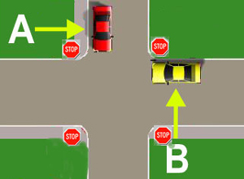

# Cars and Conditional Probability

So far you have gotten a glimpse of how probability is used in self-driving cars when events are independent from each other. However, in many cases, the previous event helps shape the probability of the current event. In this case, these events are said to be conditional, meaning they are affected by another (usually previous) event. This is a bit of a tricky nuance so let us spend some time trying to build some intuition.

- Suppose your self-driving car and another car arrive at a four-way stop. 

- The rules of the road state that the car that arrives at the stop sign first has the right of way to continue through the intersection before the other car.

- Unfortunately, sometimes this is hard to determine because two cars appear to get to the stop sign at the same time.

- Additionally, sometimes, the car that arrives second will actually go before the car that arrives first (thus breaking the law).

- Suppose your car and another car arrive at the intersection at roughly the same time. The probability you arrived first is 0.6. What is the probability that the other car arrived first?
    - `0.4`

- At this point you know have several scenarios. You could arrive first, or you could arrive second. If you arrive first, you could go first or second, and similar for arriving second. However, the action of going is dependent on whether you arrived first or second.

- This is called conditional probability, and can be denoted as P(X|Y)
- P(X∣Y) (read as "the probability of X given Y").

- Assume P(**Go First** | **Arrived First**) = 0.8. What is the P(**Go Second** ∣ **Arrived First**)?

